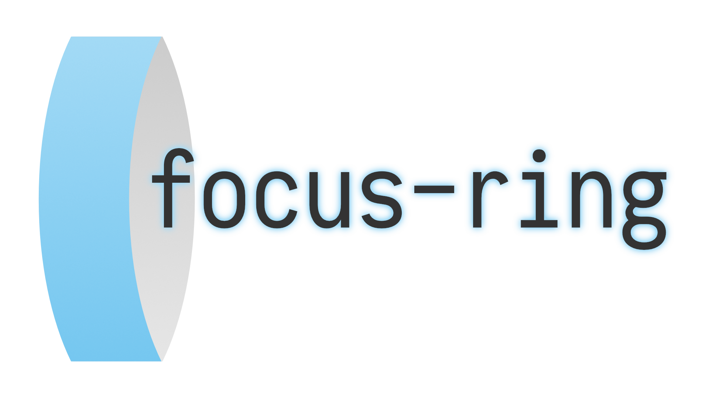

<p align="center">
	
	<br>
	<a href="https://www.npmjs.org/package/focus-ring"></a> <a href="https://travis-ci.org/jgierer12/focus-ring"></a> <a href="https://david-dm.org/jgierer12/focus-ring"></a>
</p>

# focus-ring

> Detect if a focus ring should be displayed

- **Tiny:** less than 500 bytes gzipped
- **Flexible:** let `focus-ring` add and remove a body class or write your own event handler
- **Unambiguous:** always falls back to displaying focus rings when in doubt
- **Simple API:** works with the call of only one function

`focus-ring` was made for the browser, but works in any JavaScript runtime if provided with a `target` that implements [`EventTarget`](https://developer.mozilla.org/en-US/docs/Web/API/EventTarget). It supports IE9+.

## Table of Contents

- [Install](#install)
- [Usage](#usage)
- [Examples & Demos](#examples--demos)
- [API](#api)
- [Contribute](#contribute)
- [License](#license)

## Install

This project uses [node](http://nodejs.org) and [npm](https://npmjs.com). Go check them out if you don't have them locally installed.

```sh
$ npm install focus-ring
```

Then with a module bundler like [rollup](http://rollupjs.org/) or [webpack](https://webpack.js.org/), use as you would anything else:

```javascript
// using ES6 modules
import focusRing from 'focus-ring';

// using CommonJS modules
const focusRing = require('focus-ring');
```

The [UMD](https://github.com/umdjs/umd) build is also available on [unpkg](https://unpkg.com):

```html
<script src="https://unpkg.co/focus-ring"></script>
```

You can find the library on `window.focusRing`.

## Usage

### Custom implementation

```js
import focusRing from 'focus-ring';

const fr = focusRing();

// Specify a target other than `document.body`
focusRing(document.querySelector('#target'));

// Listen to individual focus ring events
fr.on(true, () => console.log('Display focus rings'));

// Remove event listeners
const listener = fr.on(false, () => console.log('Hide focus rings'));

fr.off(false, listener);

// Listen to both events
fr.on('*', e => console.log('Focus rings updated. New value: ' + e.value));
```

### Default implementation

This implementation adds a class to the `focus-ring` target when focus rings should be displayed and removes it if they can be hidden.

```js
import focusRing from 'focus-ring';

// Adds `.focus-ring` class to `document.body`
focusRing.addClass();

// Adds `.custom` class to element with ID `target`
focusRing.addClass('custom', document.querySelector('#target'));

// Still supports custom event handlers so you can add additional logic
focusRing.addClass().on('*', console.log);
```

## License

[ISC License](./LICENSE.md) © Jonas Gierer
